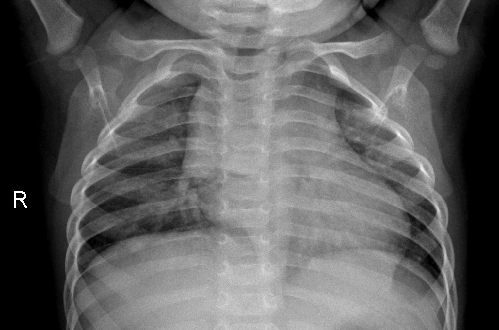
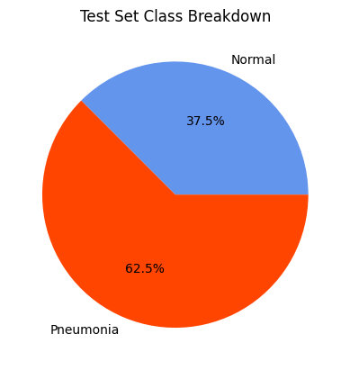
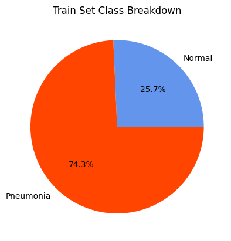

# Convoluted Pneumonia Detection

_Detecting pneumonia from chest x-rays using convolutional neural networks in tensorflow_

One of these people is healthy, and the other has pneumonia. Can you tell which is which?

## Data Set

The data set can be found [here](https://www.kaggle.com/datasets/paultimothymooney/chest-xray-pneumonia).

## Overview

The standard technology to answer this question is a convolutional neural network. While we could train a "standard" neural network to glean information from images, in practice it's much easier to use special kinds of layers -- called convolutional layers -- which contain information not just from a single pixel, but from a small region of the image. The kind of "window" that these layers provide into the image is represented by a [convolution](https://en.wikipedia.org/wiki/Convolution):

_2D convolution animation. Michael Plotke, CC BY-SA 3.0 <https://creativecommons.org/licenses/by-sa/3.0>, via Wikimedia Commons_

With convolutional layers, we can train neural nets to understand image data much more effectively.

### Exploratory Analysis

Besides just looking at the image in the training set, the main data analysis I performed was just seeing how many images fell into each category. On my League of Losers project, I was lucky that there was basically a 50-50 split between each category. However, this data set was significantly skewed towards the pneumonia category:

This causes some issues. If our neural network just predicted that everything was pneumonia, it would have over 60% accuracy! In practice, we would also be very concerned both about **false positives** and **false negatives**, and we can't determine the rate of either misdiagnosis just by looking at accuracy. One way that we can think about this trend is in terms of **precision** and **recall**: precision is the ratio of true positives to "retrieved elements" (which are true positives _and_ false positives), and recall is the ratio of true positives to "relevant elements" (relevant elements are true positives and false _negatives_).

_Visualization of precision and recall. Walber, CC BY-SA 4.0 <https://creativecommons.org/licenses/by-sa/4.0>, via Wikimedia Commons_
